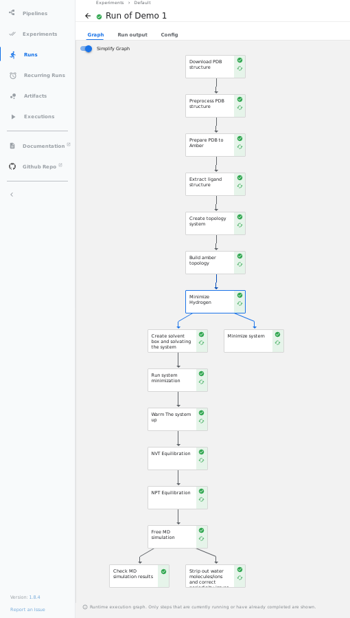
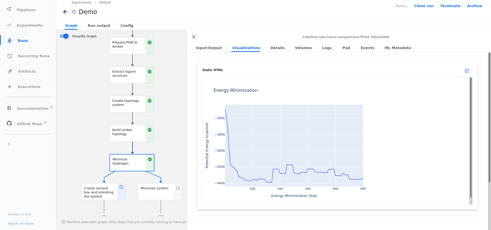

# Kubeflow pipeline for Protein-ligand complex MD Setup using the BioExcel Building Blocks (biobb)


## Usage Examples


### Setup local developement environment

1- Run this command: 
  ```bash
  # Choose the pipeline version to install
  export PIPELINE_VERSION=1.8.4

  # Run the setup cluster script
  chmod +x deployment/local/setup-cluster.sh

  ./setup-cluster.sh
  ```
  - This will download `kubectl`, `k3s` and install kubeflow `CRDS` and `Kubeflow pipelines`. 
  - If you want to install a different version of kubeflow pipelines just update the environment variable `PIPELINE_VERSION`

2- Verify setup by running:
  ```bash
  kubectl get pods -n kubeflow
  ```

3- Open Kubeflow UI:
  ```bash
  kubectl port-forward svc/ml-pipeline-ui 8080:80 -n kubeflow
  ```
  - Pipeline ui is available at [http://localhost:8080](http://localhost:8080)


### Setup the Environment and the Package

- Setup directly on the host (optionally using `venv`):
  ```bash
  virtualenv venv
  source venv/bin/activate
  pip install -r requirements.txt
  pip install -e .
  ```

- **(Optional)** Build Docker images and push them to your preffered registry (`e.g: REGISTRY=your_regitry`)
  ```bash
  # Build Image for data ingestion module
  docker build -t $REGISTRY/biobb_io:3.6.0 -f biobb_md_setup/components/data_ingestion/Dockerfile .

  # Build Image for chemical conversion module
  docker build -t $REGISTRY/biobb_chemistry:3.6.0 -f biobb_md_setup/components/chemical_conversion/Dockerfile .

  # Build Image for molecular dynamics analysis module
  docker build -t $REGISTRY/biobb_analysis:3.7.0 -f biobb_md_setup/components/md_analysis/Dockerfile .

  # Build Image for md simulation using amber module
  docker build -t $REGISTRY/biobb_amber:3.6.2 -f biobb_md_setup/components/md_simulation/Dockerfile .

  # Build Image for all related pdb operations (extraction, modification) module
  docker build -t $REGISTRY/biobb_structure_utils:3.6.1 -f biobb_md_setup/components/pdb_operations/Dockerfile .
  ```

  - If rebuilt, this images needs to be pushed and then updated in the `biobb_md_setup/pipeline/pipeline.py` file. 

  - For Demo purposes This images has been already built and pushed to `DockerHub`: 
  ```bash
  docker pull oussemalouati/biobb_structure_utils:3.6
  docker pull oussemalouati/biobb_amber:3.6.2
  docker pull oussemalouati/biobb_chemistry:3.6.0
  docker pull oussemalouati/biobb_io:3.6.0
  docker pull oussemalouati/biobb_analysis:3.7.0
  ```

- Compile the pipeline and generate the YAML template.
  ```bash
  python biobb_md_setup/pipeline/pipeline.py
  ```
  - This will generate `biobb_md_setup/pipeline/pipeline.yaml`
  - Use this `biobb_md_setup/pipeline/pipeline.yaml` to create new pipeline using the Kubeflow UI


## Kubeflow Pipeline

- Full Pipeline:


     

- All plotly figures from the notebook can been seen in the `visualisation` tab in Kubeflow UI in their corresponding steps


## Repository Structure

The codebase is structured as follows:

```bash
.  
|-- deployment  ................. # Folder hosting all deployment related scripts
|   `-- local   ................... # Scripts for local deployment environment
|-- notebooks   ................. # Notebooks
`-- biobb_md_setup .............. # Main folder
    |-- components ................ # System component implementations
    |   |-- chemical_conversion ..... # Module for chemical conversion related scripts
    |   |-- data_ingestion ............. # Data ingestion module
    |   |-- data_visualisation ......... # Data visualisation module
    |   |-- md_analysis ................ # Molecular dynamics analysis module
    |   |-- md_simulation .............. # Module to gather all molecular dynamics using amber tools
    |   `-- pdb_operations ............. # Module for pdb operations (extractions, modifications)
    |-- pipeline   ................ # Pipeline in Kubeflow
    |   `-- pipeline.py
    `-- version.py ................ # package version
`-- .gitignore .................... # Git untracked files
|
├── .pre-commit-config.yaml ....... # Git pre-commit webhooks for linting and testing
│
├── setup.py ...................... # package setup script
│
├── CONTRIBUTING.md  .............. # Project contribution guidelines
├── LICENSE ....................... # Project software license
└── README.md ..................... # This document
```

# TL;DR

- Run:
  ```bash
  virtualenv venv

  source venv/bin/activate

  pip install -r requirements.txt

  pip install .

  python biobb_md_setup/pipeline/pipeline.py
  ```
- Upload the generated `biobb_md_setup/pipeline/pipeline.yaml` to your Kubeflow UI

- Wait for results


## EXTRA & DISCUSSIONS

### Docker Images & components

- The pipeline code base is divided into `5` logical sections as shown under `biobb_md_setup/components`

- `5` different dockerfiles are used that are built on top of their corresponding `quay.io/biocontainers/*` . For some of them we are not actually adding any external/internal dependencies, but it is a good practice first to not rely on public images, second to be able at any time to extend the image by adding new dependecies or code.

- Instead of the `5` Dockerfiles we can have a single big Dockerfile with all dependecies inside.

  - Advantages: 

    - Not having to deal with multiple dockerfiles

  - Disadvantages: 

    - This docker images will have a size `~5GB`, the other 5 images sizes are: 

      `oussemalouati/biobb_structure_utils .. 333MB` \
      `oussemalouati/biobb_amber  ............          1.43GB` \
      `oussemalouati/biobb_analysis ......... 1.51GB` \
      `oussemalouati/biobb_chemistry ........ 1.22GB` \
      `oussemalouati/biobb_io ...............        330MB` \

      Pulling an image of 5GB each time just to download a PDB or do a chemical conversion is an added overhead and will create unessary latency in each pipeline

    - `conda` inside Docker is known to have multiple issues 
    - It is a good practice to divide our code base to different components that are each dedicated to just certain logical task, For better debugging, easier dependecy management. \
     **e.g:** `biobb` packages used support `python 3.7` as the latest version, so in the future if we ever have a new components that needs `python 3.8` or later, the system is already modular we can add new components with it's own dockerfile without creating conflict.

- Components in this pipeline are created based on `3` criterias

  - Consecutive steps that do the same logical function (`e.g: molecular dynamics related scripts`)
  - Consecutive steps that uses the same base image (`e.g: Amber`)
  - (If a plot exists) Steps finishes with a plotly plot if it exists

  Example: 

   - Step 1: Hydrogen minimization
   - Step 2: Checking Hydrogen minimization
   - Step 3: Plot Energy minimization

   --> These three steps are part of the molecular dynamics process (`Criteria 1`) and uses the same base image (`Criteria 2`) and finishes with a plotly plot (`Criteria 3`) So these 3 steps are to be run together inside `1` Kubeflow step as shown in the screenshot above, the step is called `Minimize Hydrogen`. 


### Kubeflow Visualisations

- Disadvantage: With kubeflow we aren't able to have interactive plots

### Improvements & TODOs

- Add an object storage (GSC, S3, MinIO) to store the final output files

- Add Logging

- Add unit tests

- Improve code Documentation

- Add the code to a code hosting platform like `Github`, and create a CI pipeline to run steps like `code linting`, run different `tests`, `Build` and `push` the different images